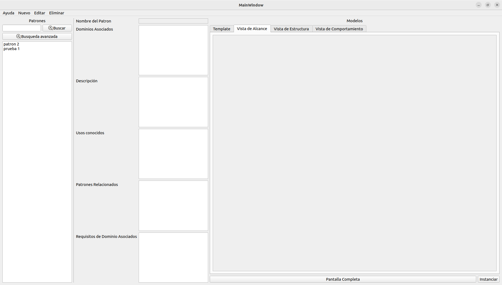

# Creación de Nuevos Patrones

## Pasos para Crear un Nuevo Patrón

1. **Ayuda**: Accede a la información necesaria para conocer, colaborar y obtener asistencia.
   
2. **Nuevo**: Crea nuevos patrones y dominios según tus necesidades.

3. **Editar**: Para editar un patrón, selecciónalo previamente. Recuerda que los dominios no pueden estar asociados a un patrón para poder ser editados.

4. **Eliminar**: Puedes eliminar un patrón sin problemas. Para eliminar un dominio, asegúrate de que no tenga patrones asociados.

5. **Buscar**: Encuentra patrones por nombre de manera rápida.

6. **Requisitos de Búsqueda**: Selecciona qué deseas buscar: Rol, Nombre o Dominio.

7. **Lista de Patrones**: Visualiza los patrones ordenados de más a menos similares.

8. **Información del Patrón**: Consulta todos los datos relevantes sobre el patrón seleccionado.

9. **Previsualizar Imágenes**: Visualiza las imágenes asociadas al patrón.

10. **Pantalla Completa**: Disfruta de una visualización de diagramas en pantalla completa.

11. **Instanciar**: Abre el diálogo para instanciar el patrón de forma sencilla.

---

¡Ahora estás listo para comenzar a crear y gestionar tus patrones!
